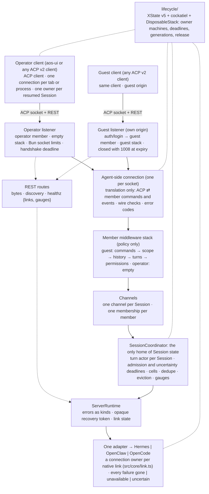

# AOS runtime gateway architecture

This document describes the shipped gateway. Every H2 is tagged
`Status: Implemented` or `Status: Target (not implemented)`. All target
content is collected in [§19 Target](#19-target-not-implemented).

**Related references** (this doc links, not restates):

- Full `_hgw/*` wire table → [`docs/protocol.md`](../protocol.md)
- Adapter obligations and five lifetimes → [`docs/development/runtime-adapter-authoring.md`](../development/runtime-adapter-authoring.md)
- Operator-facing summary → [aos-ui's `docs/architecture.md`](https://github.com/AlmogBaku/aos-ui/blob/main/docs/architecture.md)
- Hermes lifecycle → [`src/adapters/hermes/README.md`](../../src/adapters/hermes/README.md)
  and [`TURN-LIFECYCLE.md`](../../src/adapters/hermes/TURN-LIFECYCLE.md)

---

## 1. Scope and legend {#1-scope-and-legend}

**Status: Implemented**

The harness-gw gateway is a Bun HTTP + WebSocket server that sits between the
client and one configured native AI runtime. It normalizes the native API behind:

- one ACP v2 WebSocket per connection (operator and guest listeners)
- REST byte and discovery routes

The gateway holds no workspace database. The native runtime owns all durable
state. The client works only with the normalized surface.

**Legend used in this document:**

| Term            | Meaning                                                                                |
| --------------- | -------------------------------------------------------------------------------------- |
| ACP             | Agent Client Protocol v2 (`@agentclientprotocol/sdk/experimental/v2`)                  |
| Client / agent  | The client end / the gateway end of the ACP socket                                     |
| Session         | One conversation, identified by a public `sessionId` the client supplies               |
| Resumed Session | A Session the client has resumed and not closed                                        |
| Turn segment    | One continuous provider execution between starts and stops                             |
| Coordinator     | `SessionCoordinator` — the process-local turn admission and journal                    |
| Listener        | Where a socket comes in and gets its member: operator or guest                         |
| Member          | One connection as the gateway admits it: principal, middleware, connection             |
| Role            | Which kind of member it is (`Principal.role`): `operator` or `guest`                   |
| Channel         | A Session's live shared presence: who has it resumed, the turn prompt, adoption        |
| Membership      | One member's presence in one channel: its subscription, position, and pending requests |

---

## 2. System shape {#2-system-shape}

**Status: Implemented**

One deployment = one runtime.

```
ACP client (operator or guest role)
        |
        | ACP v2 WebSocket  /api/v1/acp
        | REST bytes+discovery  /api/v1/*
        v
Bun HTTP server  (src/server.ts → bunServe)
        |
        | Hono app + ACP socket mount  (src/cli/serve.ts)
        v
AcpConnectionContext  (src/acp/types.ts)
        |
        | per-connection memberships  (src/acp/agent-sessions.ts)
        | member commands and events  (src/core/member.ts; ACP encoding in src/acp/member-encoder.ts)
        v
member middleware stack  (src/guest/middleware; empty for the operator)
        |
        | member {connection, middleware, principal}
        v
Channels: one channel per Session, one membership per member  (src/core/channel.ts)
        |
        v
SessionCoordinator  (src/core/session-coordinator.ts)
        |
        | ServerTurnEngine
        v
ServerRuntime / ServerTurnEngine  (src/core/runtime.ts)
        |
        | one adapter  (src/adapters/create-runtime.ts)
        v
Hermes | OpenClaw | OpenCode  (native transport)
```



`createConfiguredProxy` (`src/composition.ts`) loads secrets once and
constructs one `RuntimeInstance` shared by every listener.

---

## 3. Trust boundaries {#3-trust-boundaries}

**Status: Implemented**

Every REST response carries security headers (`src/app.ts`):

```
cache-control: no-store
content-security-policy: default-src 'none'; frame-ancestors 'none'
referrer-policy: no-referrer
x-content-type-options: nosniff
x-frame-options: DENY
```

Origin is guarded at the server level: `guardOrigins` (`src/origins.ts`),
called from `src/server.ts` before socket matching, refuses an upgrade or any
non-GET/HEAD/OPTIONS request whose `Origin` is not in the listener's
`allowedOrigins` list (defaults to the listener's `publicOrigin`). The one
exception is `POST /api/v1/guest-invitations` on the operator listener, which
admits a missing `Origin`. The ACP service does not check the origin itself.

All log values pass through `redactForLog` (`src/redaction.ts`), which replaces
credential-bearing field values with `"[REDACTED]"`, strips query strings and
credentials from URLs, and serializes every `Error` as an object carrying its
`name`, redacted `message`, and — when the native failure provides them —
`code`, `reason`, and the full `cause` chain. Stack traces are omitted.
Secret files are absolute paths read once at startup (`src/secrets.ts`); the
secret bytes never appear in config, logs, or responses.

---

## 4. Listeners and roles {#4-listeners-and-roles}

**Status: Implemented**

### 4.1 Operator listener

No application login. Network access grants full operator context; `principalId`
defaults to `"operator"` (`src/acp/service.ts`). Routes: `/api/v1/*`,
`/api/v1/acp` (WebSocket, `src/cli/serve.ts`). Everything outside `/api/v1` is
404; static assets and `/runtime-config.json` are served by the client, not the
gateway.

### 4.2 Guest listener

Physically separate listener and origin (validated different from operator,
`src/config.ts`). JWT: type `aos-guest-invitation+jwt`, HS256, issuer
`aos-invite`, audience `aos-guest` (`src/auth/guest-invitation.ts`). Claims
include `deploymentId`, `runtimeId`, `agentId`, `ref`, optional `firstTurn`,
expiry. Default TTL 259 200 s (`src/config.ts`).

API prefix `/api/v1`; ACP at `/api/v1/acp`. Everything outside `/api/v1` is 404
(`src/cli/serve.ts`), except `/api/health`.

**Authentication** (`src/guest/acp.ts`). An unauthenticated guest's
`initialize` omits runtime info (`src/acp/agent.ts`). `auth/login` redeems the
token and gives the connection its member: a guest principal and the guest
middleware stack. A second `auth/login` on the same connection is refused
(`src/guest/acp.ts`). At expiry the socket gate stops every frame in both
directions and closes with code 1008
(`src/acp/socket.ts`), and an expiry timer closes the
connection, re-arming in steps of at most 2^31−1 ms
(`src/guest/acp.ts`).

**Extensions** (`GUEST_EXTENSIONS`, `src/guest/acp.ts`): `steer:true`,
`rewind:true`, `composerPrefill:true`, `agents:false`, `invalidation:false`,
`activity:false`, `readState:false`, `focus:false`, `guestProjection:true`,
`historyPages:true`. The invited Session reports slash commands, models, and
context usage unavailable (`src/guest/middleware/commands.ts`).

**Middleware** (`src/guest/middleware/index.ts`). Every ACP method runs as a
member command down the stack commands → scope → history → turns →
permissions, and every member event passes back up it in reverse
(`src/core/member.ts`). A method the stack does not admit is method not
found before its params are decoded (`src/acp/agent.ts`).

| Layer         | Rule                                                                                                                                                                                                                                                                        |
| ------------- | --------------------------------------------------------------------------------------------------------------------------------------------------------------------------------------------------------------------------------------------------------------------------- |
| `commands`    | Admits resume, older pages, send, steer, Stop, close, answers, and focus; refuses list, new, delete, update, config, and the Agent catalog. Refuses slash text (leading `/`, even after whitespace or zero-width characters) and envelope-shaped text. Focus moves nothing. |
| `scope`       | Only the invited reference; the first Send creates the Session with the invitation's setup text. Stop reaches only the invited conversation.                                                                                                                                |
| `history`     | Projects history pages; Edit and Retry may name only a user message this connection was shown.                                                                                                                                                                              |
| `turns`       | Shows the conversation's text whole and an MCP App's card; drops reasoning, tool input and output, the model, Session rows, and command lists.                                                                                                                              |
| `permissions` | Hides every permission request. One in a turn the guest started (`startedBy`) is declined: `deny`, or `cancelled` when `deny` is not offered (`src/core/channel.ts`). Questions pass whole.                                                                                 |

**Feeds** are chosen at join. The guest is given none (`src/guest/acp.ts`): no
usage, no model, no activity, no read state, and no catalog.

**Errors** reach a guest as public codes only: the guest socket maps every
error reply and `_hgw/error` notification through `PUBLIC_ERRORS`
(`src/acp/socket.ts`; `src/acp/validation.ts`).

### 4.3 Shared runtime instance

Both listeners share one `RuntimeInstance`. Per-connection `SessionRows` and
`AttachmentStageRegistry` are listener-local (`src/cli/serve.ts`).

---

## 5. The single ACP socket {#5-the-single-acp-socket}

**Status: Implemented**

The client opens one WebSocket per connection. The 101 response carries
`Acp-Connection-Id` (`src/acp/service.ts`), a UUID the gateway mints per
connection.

**Handshake** (`initialize`): the response `_meta.hgw` carries `version`,
`role`, and the `extensions` map (`protocol/acp.ts`; `src/acp/agent.ts`).
Guests receive the `GUEST_EXTENSIONS` map and an `authMethods` list with the
invite method.

**Per-connection Session ownership**: the per-connection `Sessions` object
(`src/acp/agent-sessions.ts`) maps public Session ids to owning Agent ids.
Only Sessions listed, created, or resumed on this connection are addressable.
`adopt` trusts a client-supplied `agentId` for `session/resume` until the
provider read confirms it.

**Upgrade rules**: origin is checked by `guardOrigins` (`src/origins.ts`) before
the socket service; a present `Origin` not in `allowedOrigins` is refused with 403. An absent `Origin` is admitted for non-browser clients. The per-Agent path
`/api/v1/acp/agents/<agentId>` scopes a connection to one Agent and must
never be exposed publicly. A cap of `operatorEventPeers` is enforced per socket
mount (`src/cli/serve.ts`).

For the full method table see [`docs/protocol.md`](../protocol.md).

---

## 6. Turn vocabulary and ACP translation {#6-turn-vocabulary-and-acp-translation}

**Status: Implemented**

The gateway owns a closed turn vocabulary defined in `src/core/events.ts`
(`TurnEventKind`). Native adapters emit these event kinds; the ACP layer
translates them to client-facing ACP payloads. Neither end depends on the
other's wire format.

Every `session/update` on a turn segment carries `_meta.hgw.sequence` and
`_meta.hgw.turnId` (`protocol/acp.ts`), so the client can position
cursor-bearing reconnects.

**HGW extension events** map to vendor wire notifications:

| Turn event kind      | Wire form                                                            |
| -------------------- | -------------------------------------------------------------------- |
| `artifact-published` | `resource_link` block, `uri: "artifact://<id>"`, on the turn's chunk |

Mapping source: `src/acp/translate/turn-events.ts`.

History replay runs through the same translators, so the client receives
identical shapes whether an event is live or replayed.

---

## 7. SessionCoordinator and adapter ownership split {#7-sessioncoordinator-and-adapter-ownership-split}

**Status: Implemented**

For adapter obligations and the five lifetimes see
[`docs/development/runtime-adapter-authoring.md`](../development/runtime-adapter-authoring.md).

**Coordinator key facts** (`src/core/session-coordinator.ts`):

| Fact                                                                                                                     |
| ------------------------------------------------------------------------------------------------------------------------ |
| Scope key: `agentId + "\0" + sessionId`                                                                                  |
| Idempotent re-admission (duplicate `turnId` replays from journal)                                                        |
| Conflict (different turn on non-idle scope → `ServerTurnConflictError`)                                                  |
| Single-flight (`#admissions` set blocks concurrent starts)                                                               |
| Per-role capacity: coordinator `maxActiveExecutions`; guest quota `guestActiveExecutions` (config key, guest middleware) |
| Controllers set; `#withControl` serialises stop+steer                                                                    |
| Steer dedup: 256 per execution, oldest evicted                                                                           |
| Stop states: `running` → `stopping` → terminal                                                                           |

**Adapter engine** (`src/core/runtime.ts`): `start`, `recover`, `discover?`
(post-process-loss), `stop`/`steer?` on handle, and adapter-private
`recoveryPosition` (`{epoch, lastSeen}`). All three factories
(`src/adapters/hermes/factory.ts`, `src/adapters/openclaw/factory.ts`,
`src/adapters/opencode/factory.ts`) pass the same config limits.

---

## 8. Requests {#8-requests}

**Status: Implemented**

A turn segment ends in either a success or a `turn-requires-action` outcome,
which carries one or more `PendingRequest` items (`src/core/events.ts`). The coordinator
retains the execution in `waiting-for-input`.

Delivery: each pending request is sent as a server→client `requestPermission`
or `elicitation.create` call with a `requestId` in `_meta.hgw`
(`protocol/acp.ts`). The Channel offers each request to every member
(`src/core/channel.ts`), a guest's middleware hides permissions, and the
member encoder asks what remains (`src/acp/member-encoder.ts`).

The coordinator collects answers per conversation, so two tabs may each answer
one request of a batch; the first answer to a request wins. Answering the last
open request starts a new turn segment whose `TurnInput` carries the `replies`
array (`src/core/channel.ts`; `src/core/session-coordinator.ts`).

Every client with the Session open is asked. Once the Session resolves a request,
through another client's answer or a Stop, each member still asking withdraws it
with `$/cancel_request`: `SessionCoordinator.subscribeScope` tells the member,
matched on its provider scope, and the client drops that Session's copy when
the request's signal aborts. A stale request (the execution has moved on)
returns JSON-RPC error `-32003 staleRequest` (`src/acp/validation.ts`).

On reconnect, pending requests are re-issued via `reissuePending`
(`src/core/channel.ts`).

---

## 9. REST byte planes {#9-rest-byte-planes}

**Status: Implemented**

All write REST routes require a listed `Origin` header. Default JSON body
cap 16 KiB (`src/routes/http.ts`). Stage registry: 256 entries, 300 s TTL
(`src/core/attachment-stages.ts`); full → HTTP 503 `turn_capacity_exceeded`.

| Route                            | Limit                             |
| -------------------------------- | --------------------------------- |
| `POST …/attachments/stage`       | 35.5 MB (`src/routes/content.ts`) |
| `GET …/artifacts/:id`            | —                                 |
| `POST …/audio/transcribe`        | 7.5 MB                            |
| `POST …/audio/speak`             | 40 KB                             |
| `GET /api/v1/runtime`            | —                                 |
| `POST /api/v1/guest-invitations` | 16 KiB JSON                       |
| `GET /api/v1/healthz`            | —                                 |
| `GET /api/v1/readyz`             | —                                 |

`GET /api/v1/healthz` always returns HTTP 200 and a JSON body:

```json
{
  "status": "ok" | "degraded",
  "links": [{ "name": "<runtime-id>", "state": "ready" | "lost" }],
  "gauges": {
    "sockets": <number>,
    "memberships": <number>,
    "executions": <number>,
    "uncertain": <number>,
    "deadlinesFired": <number>,
    "journalBytes": <number>
  }
}
```

`status` is `"degraded"` when at least one native link is `lost`; the gateway
always answers 200 — a link down degrades it, not restarts it. The `links`
array has one entry per configured runtime; `gauges` are current process
counters (`src/composition.ts`, `src/core/session-coordinator.ts`).

Guest mirrors the same routes under `/api/v1/` with authorization and
smaller staging limits (`src/guest/context.ts`).

---

## 10. Read state, focus, and activity {#10-read-state-focus-and-activity}

**Status: Implemented**

**Read state** (`src/acp/read-state.ts`): a `_hgw/session/focus` notification from
the client arms a debounce timer (400 ms, `FOCUS_DEBOUNCE_MS`). When it fires
the gateway writes a read watermark to the provider. A floor of 5 000 ms
(`REACK_FLOOR_MS`) prevents redundant writes. The provider's `sessionReadState`
capability is checked once and cached. Guest connections carry no read state
(`src/acp/types.ts`); a guest's focus report is accepted and moves nothing
(`src/guest/middleware/commands.ts`).

**`SessionRows`** (`src/core/session-rows.ts`): the gateway-local row cache.
A write guard of 10 s (`READ_GUARD_MS`) prevents a list read that races the
mark-read write from clearing an optimistic `unread: false`.

**Activity feed** (`src/acp/activity-feed.ts`): no buffer. On connect, the feed
hydrates by reading one catalog page (100 entries, `HYDRATION_PAGE_SIZE`),
publishing the current `unread` state and any attention-needing execution per
row; live execution events from the coordinator fill the feed thereafter. Events
reach the client as `_hgw/activity` notifications.

Guest connections carry no activity feed (`src/acp/types.ts`).

---

## 11. Invalidation and Session-change signals {#11-invalidation-and-session-change-signals}

**Status: Implemented**

| Notification                        | Trigger                                                                                                                                             |
| ----------------------------------- | --------------------------------------------------------------------------------------------------------------------------------------------------- |
| `_hgw/catalog_invalidated`          | `subscribeCatalogChanges` fires (Hermes `sessions.changed`, `src/acp/agent.ts`; `src/adapters/hermes/adapter.ts`); also sent after `session/delete` |
| `session_info_update` (`_meta.hgw`) | `SessionRows` subscriber on a changed row (`src/acp/agent.ts`; `src/core/session-rows.ts`)                                                          |
| `_hgw/activity`                     | Activity feed push (execution events, unread changes)                                                                                               |

A subscriber that falls behind the fanout bounds is detached (`membership.detached`
in the log); catch-up happens through a standard `session/resume` with
`replayFrom: { type: "start" }`, not through `_hgw/session_invalidated`.

---

## 12. Reconnect and replay {#12-reconnect-and-replay}

**Status: Implemented**

**Client**: exponential backoff 250 ms → 5 000 ms
(`client/connection.ts`). The client rejoins each
resumed Session via `session/resume` with `_meta.hgw.after` (last sequence)
and `turnId` (`protocol/acp.ts`); a cursor the gateway can no longer
answer is rebuilt from history in that same resume. Guest re-logins before
resuming.

**Gateway**: coordinator journal holds every event of a turn segment, bounded by
the subscriber limits (`limits.subscriberEvents`/`limits.subscriberBytes`). Adjacent text
deltas merge on read to save replay size while keeping cursors exact
(`src/core/session-coordinator.ts`). When the journal cannot
answer the cursor, the coordinator throws `ReplayCursorLostError` and the
channel rebuilds the member's view from history with standard `session/update`s
before the resume answers (`src/core/channel.ts`).

The `discover` preamble reconstructs authoritative state before replay
(`src/acp/agent.ts`). `reissuePending` re-delivers pending requests after
reconnect (`src/core/channel.ts`). Adapter-private
`{epoch,lastSeen}` positions the native stream (`src/core/runtime.ts`).

**Accepted steering survives replay exactly once.** A provider that persists the
correction the moment it accepts it makes that turn part of authoritative
history, so a from-start resume announces each persisted correction exactly once:
the history row wins and the journal's acknowledgement of it is dropped, in
acceptance order.

---

## 13. Limits and backpressure {#13-limits-and-backpressure}

**Status: Implemented**

**ACP socket** (`src/acp/socket.ts`):

| Limit                        | Value                     |
| ---------------------------- | ------------------------- |
| Max inbound frame            | 1 100 000 bytes (≈1.1 MB) |
| Inbound rate window          | 1 s, 64 frames, 256 KiB   |
| Outbound queue               | 256 frames, 4 MiB         |
| Rate exceeded close code     | 1008                      |
| Output overloaded close code | 1013                      |

**Per-role execution caps** (`src/config.ts`): `activeExecutions` (global)
and `guestActiveExecutions`. Both are validated: guest cap must not exceed
global cap (`src/config.ts`).

**REST caps**: stage 35.5 MB, transcribe 7.5 MB, speak 40 KB, default JSON
16 KiB (`src/routes/http.ts`). Stage registry: 256 entries, 300 s TTL.

**Subscriber fan-out** (`src/config.ts`): `subscriberEvents` and
`subscriberBytes` bound the coordinator journal and per-subscriber replay.

---

## 14. Configuration and secrets {#14-configuration-and-secrets}

**Status: Implemented**

`ProxyConfig` (`src/config.ts`): `listen` (host union `{127.0.0.1,::1,0.0.0.0,::}`

- port; wide hosts require `exposure: "private-container"`);
  `publicOrigin` (HTTPS or loopback HTTP); `allowedOrigins` (defaults to
  `publicOrigin`); `keys` (1–3 HS256 secret keys); `limits`; `runtime`
  (discriminated union `kind ∈ {hermes,openclaw,opencode}`); `guest` must use a
  separate origin and listener; `shutdownGraceMs`.

`parseProxyConfig` stays opaque for library callers: it rejects the whole
config with `"Invalid proxy configuration"` so rejected input containing
secrets is never logged. The startup path is different. `loadProxyConfig` in
`src/config-file.ts` resolves the path (via `HARNESS_GW_CONFIG_FILE` or the
discovered `${XDG_CONFIG_HOME:-$HOME/.config}/harness-gw/config.yaml`), checks
the file, parses the YAML, merges defaults and `HARNESS_GW_*` overrides, and
validates with the exported schema directly; a failure becomes a
`ProxyConfigurationError` carrying the file path and the field paths (never a
value), and `src/cli.ts` logs it through `describeStartFailure`, which unwraps
only that class into a plain object. `redactForLog` therefore keeps its
every-`Error`-is-opaque invariant for every other failure while a configuration
problem stays readable in the startup log.

**Secret files** (`src/secrets.ts`): absolute paths, regular non-symlink
files, permissions `0o600` or tighter, max 8 KiB, read once at startup.

**Shutdown** (`src/server.ts`; `src/cli/serve.ts`): SIGINT/SIGTERM drains
in-flight requests within `shutdownGraceMs`; both listeners share the grace.

---

## 15. Adapter kinds and selection {#15-adapter-kinds-and-selection}

**Status: Implemented**

`src/adapters/create-runtime.ts` is the sole selector. No other production module
branches on `kind` (enforced by `src/architecture.test.ts`).
There is no fixture adapter server-side.

| Kind       | Native client                                                                  | Credential files                        | Steering                 |
| ---------- | ------------------------------------------------------------------------------ | --------------------------------------- | ------------------------ |
| `hermes`   | Vendored JSON-RPC WebSocket + HTTP (`src/adapters/hermes/README.md`)           | `tokenFile`                             | Available                |
| `openclaw` | `@openclaw/gateway-client` `GatewayClient` (`src/adapters/openclaw/client.ts`) | `deviceIdentityFile`, `deviceTokenFile` | Unavailable              |
| `opencode` | `@opencode-ai/sdk/v2/client` (`src/adapters/opencode/client.ts`)               | `passwordFile`                          | Native-steering-unproven |

---

## 16. Errors {#16-errors}

**Status: Implemented**

**REST `ErrorCode` values** (`src/routes/http.ts`): `unauthenticated`,
`forbidden`, `invalid_request`, `not_found`, `revision_conflict`,
`unsupported`, `turn_conflict`, `turn_capacity_exceeded`, `runtime_authentication_required`,
`temporarily_unavailable`, `connection_interrupted`, `uncertain_mutation`,
`internal_error`.

**`ServerRuntimePublicError` codes** (`src/core/runtime.ts`): same names
except `turn_conflict` and `internal_error`; maps to JSON-RPC via
`src/acp/validation.ts`.

**JSON-RPC extension codes** (`protocol/acp.ts`, `HGW_JSONRPC_ERRORS`):
ACP standard codes `-32000` (internal), `-32002` (cancelled), `-32601`
(method not found), `-32602` (invalid request), `-32800` (request cancelled);
HGW block `-31010` turnInProgress, `-31011` staleRequest, `-31012`
revisionConflict, `-31013` temporarilyUnavailable, `-31014` uncertainMutation,
`-31015` unsupported. Codes `-32001` through `-32009` are no longer used.

**Vendor stop reasons** on `state_update { state: "idle" }`: `_hgw_error`,
`_hgw_uncertain` (`protocol/acp.ts`).

All errors pass through `redactForLog`. Native bodies, credentials, paths, and
stack traces never cross either listener.

---

## 17. Tests that enforce the boundaries {#17-tests-that-enforce-the-boundaries}

**Status: Implemented**

| Test file                                      | What it checks                                                                                                           |
| ---------------------------------------------- | ------------------------------------------------------------------------------------------------------------------------ |
| `src/architecture.test.ts`                     | Native types out of common gateway and client modules; each runtime selected in exactly one module; role-isolation rules |
| `test/architecture/adapter-boundaries.test.ts` | Provider packages do not import each other                                                                               |
| `test/architecture/package-contents.test.ts`   | Published package does not contain server code                                                                           |
| `src/core/session-coordinator.test.ts`         | Coordinator admission, capacity, conflict                                                                                |
| `src/acp/*.test.ts`                            | ACP protocol, read state, activity feed, socket limits                                                                   |

---

## 18. Invariants {#18-invariants}

**Status: Implemented**

| #   | Invariant                                                                                                                                  | Checked by                                               |
| --- | ------------------------------------------------------------------------------------------------------------------------------------------ | -------------------------------------------------------- |
| 1   | One runtime per deployment (`src/config.ts`)                                                                                               | `src/architecture.test.ts`                               |
| 2   | Adapter boundary: `acp/`,`auth/`,`core/`,`guest/`,`routes/`, client never import native packages                                           | `src/architecture.test.ts`, `adapter-boundaries.test.ts` |
| 3   | AG-UI absent from the gateway                                                                                                              | `src/architecture.test.ts`                               |
| 4   | `src/adapters/create-runtime.ts` is the only runtime-kind branch                                                                           | `src/architecture.test.ts`                               |
| 5   | No synthetic fallback server-side                                                                                                          | runtime-mode validation at startup                       |
| 6   | Guest listener fails closed; `steer`,`rewind`,`composerPrefill` = `true`; `agents`,`invalidation`,`activity`,`readState`,`focus` = `false` | `src/guest/acp.test.ts`                                  |
| 7   | `guestActiveExecutions` ≤ `activeExecutions`                                                                                               | `src/config.ts` (`superRefine`)                          |
| 8   | Turn control requires registered `principalId`                                                                                             | `src/core/session-coordinator.ts`                        |
| 9   | Steer dedup: same `requestId`+fingerprint → same result; different fingerprint → conflict                                                  | `src/core/session-coordinator.ts`                        |

---

## 19. Target (not implemented) {#19-target-not-implemented}

**Status: Target (not implemented)**

The following capabilities are in the design direction but have no shipped
implementation:

- **Multi-runtime per deployment.** One config, multiple concurrent runtimes
  with per-runtime namespacing.
- **Multi-tenant operator authentication.** Per-user identity, sessions, and
  OIDC/SAML login before reaching the ACP socket.
- **Principal-specific upstream identities.** Per-user credentials forwarded
  to the native runtime.
- **Multi-worker turn ownership.** Distributing coordinator state across
  processes or machines.
- **Operator authentication cookies.** Server-side cookie jars or trusted
  identity assertions for the operator listener.

Until these are implemented the proxy runs as a single-process, single-runtime,
no-application-login server.

---

## 20. Research basis {#20-research-basis}

**Status: Implemented**

This document is derived from the production source at commit `c05309f`
(2026-09-20). The ACP v2 migration landed in commits `046d3bf`, `64fe9dc`,
`774d1b1`. The browser cutover landed in `92a24f2`; run vocabulary in
`f042380`. Gateway architecture was designed in
[`docs/design/aos-runtime-gateway-v1.md`](aos-runtime-gateway-v1.md) and the
[AOS runtime gateway V1 retrospective](https://github.com/AlmogBaku/aos-ui/blob/main/docs/development/hermes-v1-retrospective.md).
